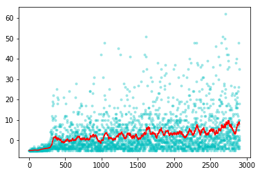
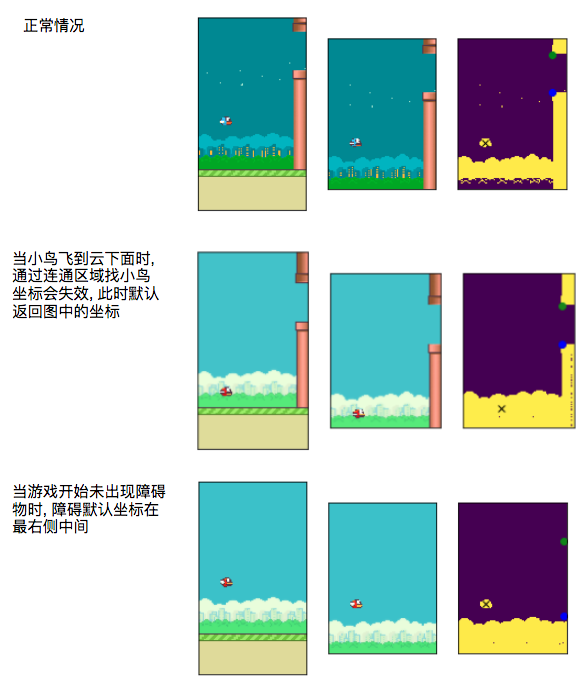

## FlappyBird

输入为根据图像提取的关键点 (鸟,拐角) 的坐标, 采用经典的 DQN 算法, 经过 380 步就已经能够收敛到比较好的结果了. 下图示例中的就是 380 迭代后的结果 (只截取了前30秒的数据, 实际持续了 5 分钟).

### 如何训练

`python3 training-lr_1_e-3.py`

### 训练关键点

1. 积累4帧的图像特征作为网络的输入, 网络可以推测速度
2. 学习率的设置成关键, 此处设为 1e-3 (1e-2根本无法收敛)

### 实现细节

**特征工程**

> FlappyBird-v0/feature_engineering/main.ipynb

1. 环境状态为一个RGB图像, 截取 `[0:400,:,:]` 范围的内容, 将无效区域去除
2. RGB 转为灰度图像 GRAY, 求得像素值的众数去除 (背景是一大块的同颜色区域), 得到图像 GRAY1
3. GRAY1 作二值化处理得到 IMG_BIT
4. 获取连通域, 计算鸟的坐标位置 (bx, by)
5. 根据二值图像 IMG_BIT 计算小鸟前方障碍物的上下坐标 (ox1, oy1) (ox2, oy2), 其中 ox1=ox2=ox
6. 计算坐标间的差值 `f(t) = (ox-bx, oy1-by, oy2-by)`
7. 叠加4帧图像以该方式提取的特征拼接成网络的输入 `[f(t-2), f(t-1), f(t)]`

