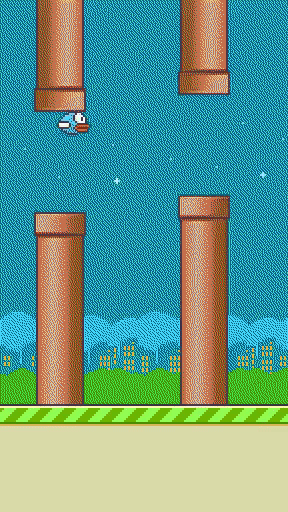
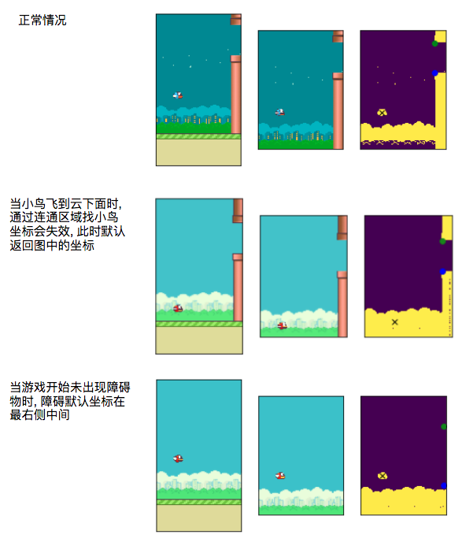

## Overview

This project demonstrates how to use Reinforcement Learning Algorithms (DQN, DDPG, etc.) with Pytorch to play games. 


## Installation Dependencies

System: Ubuntu 16.04, 4vCPU, 8G, 2.5GHz, Aliyun ECS


### Pip3

```
apt-get update
apt-get install python3-pip
```

### Pytorch, Gym

``` bash
pip3 install torch torchvision
pip3 install gym_ple pygame
apt-get install -y python-pygame
```

> https://github.com/lusob/gym-ple
> gym_ple requires PLE, to install PLE clone the repo and install with pip.

``` bash
git clone https://github.com/ntasfi/PyGame-Learning-Environment.git
cd PyGame-Learning-Environment/
pip install -e .
```

**Box2D**

``` bash
apt-get install swig git
git clone https://github.com/pybox2d/pybox2d.git
cd pybox2d
python setup.py clean
python setup.py install
```

### Xvfb (Fake screen)

> xvfb should be installed when using linux server (env.render()) 

HINT: make sure you have OpenGL install. On Ubuntu, you can run 'apt-get install python-opengl'. If you're running on a server, you may need a virtual frame buffer; something like this should work: 'xvfb-run -s "-screen 0 1400x900x24" python <your_script.py>'

``` bash
apt-get install xvfb, python-opengl
apt-get install libav-tools
```

### Jupyter

> It is easy to coding in Jupyter Web UI http://0.0.0.0:8888/.

``` bash
pip3 install jupyter
jupyter notebook --generate-config  # ~/.jupyter/jupyter_notebook_config.py
```

**Generate passward using jupyter-console**

```
In [1]: from notebook.auth import passwd
In [2]: passwd()
```

**Jupyter config**

```
## The IP address the notebook server will listen on.
c.NotebookApp.ip = '*'   # allow ALL
  
#  The string should be of the form type:salt:hashed-password.
c.NotebookApp.password = u'sha1:96d749b4e109:17c2968d3bc899fcd41b87eb0853a42ceb48c521'
  
## The port the notebook server will listen on.
c.NotebookApp.port = 8888
 
c.NotebookApp.open_browser = False
```

### Issues

**locale.Error: unsupported locale setting**

`export LC_ALL=C`

**opengl-libs xvfb-run conflict**

https://davidsanwald.github.io/2016/11/13/building-tensorflow-with-gpu-support.html

    What @pemami4911 wrote on #366 (THANKS!) finally pointed me into the right direction.

    I didn't xvfb and sadly also X-dummy to work for a long time but when I followed pemami4911's hint and installed the Nvidia driver with --no-opengl-files option and CUDA with --no-opengl-libs xvfb worked right away.
    I did not have to do anything complicated, just installing drivers with --no-opengl-files and CUDA with --no-opengl-libs. Just in case I documented the necessary steps here


----

## FlappyBird


输入为根据图像提取的关键点 (鸟,拐角) 的坐标, 采用经典的 DQN 算法, 经过 380 步就已经能够收敛到比较好的结果了. 下图示例中的就是 380 迭代后的结果 (只截取了前30秒的数据, 实际持续了 5 分钟).




### 如何训练

`python3 training-lr_1_e-3.py`

### 训练关键点

1. 积累4帧的图像特征作为网络的输入, 网络可以推测速度
2. 学习率的设置成关键, 此处设为 1e-3 (1e-2根本无法收敛)

### 实现细节

**特征工程**

> FlappyBird-v0/feature_engineering/main.ipynb

1. 环境状态为一个RGB图像, 截取 `[0:400,:,:]` 范围的内容, 将无效区域去除
2. RGB 转为灰度图像 GRAY, 求得像素值的众数去除 (背景是一大块的同颜色区域), 得到图像 GRAY1
3. GRAY1 作二值化处理得到 IMG_BIT
4. 获取连通域, 计算鸟的坐标位置 (bx, by)
5. 根据二值图像 IMG_BIT 计算小鸟前方障碍物的上下坐标 (ox1, oy1) (ox2, oy2), 其中 ox1=ox2=ox
6. 计算坐标间的差值 `f(t) = (ox-bx, oy1-by, oy2-by)`
7. 叠加4帧图像以该方式提取的特征拼接成网络的输入 `[f(t-2), f(t-1), f(t)]`


