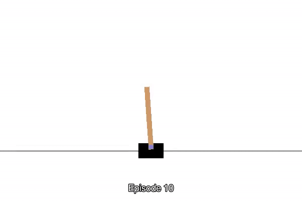

这个项目主要用于记录利用增强学习算法玩转 GYM 游戏的实现过程。

## 环境准备

利用 ALIYUN ECS 机器搭建了一个 Jupyter 平台，可以方便的在线编辑代码并进行训练，更重要的是价格还便宜。一个抢占式的实例每小时只需要0.37元。
具体环境准备过程详见 [setting_env.md](setting_env.md)

## Gym Games

### FlappyBird-v0

目前实现了 DQN 算法玩 FlappyBird-v0, 迭代了400+的模型能够完成 5 分钟的自主飞行。详情请见 [FlappyBird-v0](FlappyBird-v0/README.MD)

### CartPole-v1

DQN 算法迭代学习过程.

